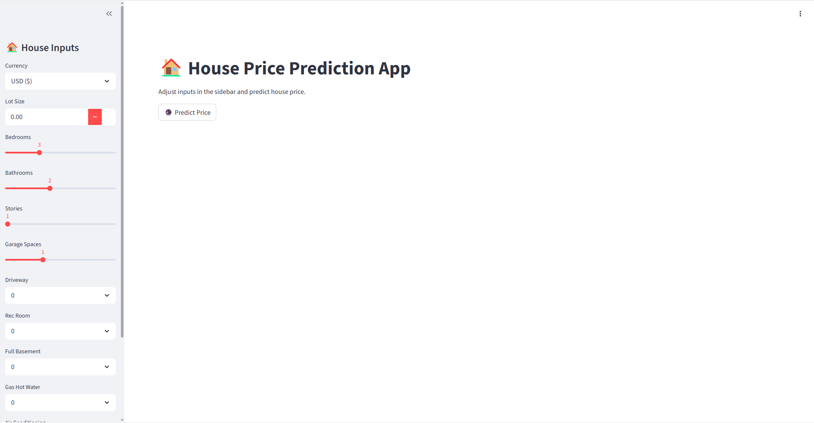

# 🏠 House Price Prediction App

A machine learning web application that predicts house prices based on key property features using a trained regression model.  
Built with **Python, Scikit-Learn, XGBoost, and Streamlit**.

---

## 🚀 Live Demo
👉 https://house-price-prediction-project-iyjw.onrender.com

---
## 🏠 Project Overview

This project is a **machine learning-powered real estate price prediction system** designed to estimate house prices based on key property features.

It simulates a real-world data science product pipeline, from data preprocessing and feature engineering to model deployment as an interactive web application.

The goal is to assist users and stakeholders in making informed property valuation decisions.

---

## 🧠 Machine Learning Workflow

1. Data Cleaning & Preprocessing  
2. Exploratory Data Analysis (EDA)  
3. Feature Engineering  
4. Model Training (Random Forest / XGBoost)  
5. Model Evaluation (R², MAE, RMSE)  
6. Model Serialization (`joblib`)  
7. Deployment using Streamlit  

---

## 📊 Features Used

- Lot Size  
- Bedrooms  
- Bathrooms  
- Stories  
- Garage Spaces  
- Driveway  
- Rec Room  
- Basement  
- Gas Hot Water  
- Air Conditioning  
- Preferred Area  

### Engineered Features:
- House Size Score  
- Luxury Score  
- Size to Rooms Ratio  
- Room Density  
- Comfort Index  
- Convenience Score  

---

## 🛠️ Tech Stack

- Python 🐍  
- Pandas & NumPy  
- Scikit-Learn  
- XGBoost  
- Streamlit  
- Joblib  

---

## 📊 Model Performance

- Model: Random Forest / XGBoost
- MAE: 9888.806640625
- RMSE: 14077.610024432413
- R2 Score: 0.69
The model was improved using feature engineering and hyperparameter tuning.

## ⚙️ How It Works

1. User inputs house details via Streamlit UI  
2. Feature engineering is applied (luxury score, comfort index, etc.)  
3. Trained ML model processes the inputs  
4. The app returns predicted price + price range

## 📁 Project Structure

House-Price-Prediction/
│
├── app.py
├── model.pkl
├── features.pkl
├── requirements.txt
├── README.md
│
├── notebooks/
│   └── analysis.ipynb
│
app_screenshot.png

## 🌟 Key Highlights

- End-to-end machine learning pipeline
- Feature engineering for improved model performance
- Interactive Streamlit web application
- Deployed live on Render
- Production-style project structure

## 👨‍💻 Author

- GitHub: https://github.com/Nagbons  
- LinkedIn: https://www.linkedin.com/in/nagbonsegbeobauwaye  
- Email: nagbonsegbeobauwaye74@gmail.com

## APP Preview 

